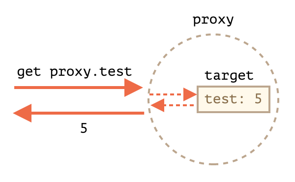

# 14.1 Proxy and `Reflect`를 사용함으로서 안전하게 그리고 큰 생각없이 작업을 전달하고 이제 잊어버릴 수 있다.

## Proxy limitations

## ✅ 복습 및 정리

TODO:

## 서론

`Proxy`는 객체는 다른 객체를 감싸고 프로퍼티 읽기/쓰기 등의 동작을 가로챕니다.
선택적으로 가로챈 것들을 제어할 수 있습니다. 또는 투명하게 그들을 제어할 수 있습
니다.

프록시는 많은 라이브러리들에서 사용되고 몇몇 브라우저 프레임워크에서 사용됩니다.

## Proxy

```js
let proxy = new Proxy(`target`, handler);
```

- `target` - 감쌀 객체, 함수를 포함한 모든 것이 가능하다.
- `handler` - proxy 설정: traps를 가지는 객체, 동작을 가로채는 메서드 (예를 들면
  프로퍼티 읽기를 위한 `get` trap, `target`에 프로퍼티를 쓰기위한 `set` trap 등
  이다)

`proxy`에서 동작을 취하면, 그에 상응하는 `handler`의 trap이 실행되고 proxy가 그
동작을 핸들링할 기회를 얻습니다. 그렇지 않으면 동작은 `target`에서 일어납니다.

```js
let target = {};
let proxy = new Proxy(target, {}); // 빈 핸들러

proxy.test = 5;
alert(target.test); // 5, target의 프로퍼티에 값이 써짐
alert(proxy.test); // 5, proxy에서도 그 값을 읽을 수 있음
for (let key in proxy) alert(key); // test, 이터레이션이 동작한다
```

즉, 트랩이 없다면 모든 동작은 target으로 전달되어진다. 바꿔 말하면 trap이 없는
`proxy`는 `target`을 감싸는 투명한 래퍼이다. proxy는 own properties가 없다.



자바스크립트 명세에는 "내부 메서드"가 있는데 로우 레벨의 동작을 설명할 때 쓰이는
`[[GET]]`이나 `[[SET]]`같은 것들이다. 이는 명세에서나 이렇게 쓰이고 실제로는
`get`, `set`같은 이름이 부여되어 있다.
[Proxy 명세](https://tc39.es/ecma262/#sec-proxy-object-internal-methods-and-internal-slots)

명세의 표를 참고해 모든 내부 메서드에 대해서 `new Proxy`시에 핸들러 메서드를 설
정해 동작을 가로챌 수 있다.

[내부 메서드의 invariants](https://tc39.es/ecma262/#sec-invariants-of-the-essential-internal-methods)라
는 것이 있는데 자바스크립트 명세에서 따르기로한 규약이다. 메부 메서드에 대한 핸
들러에서 이 규칙을 지켜주지 않으면 예상하지 못한 행동이나 보안 이슈가 생길 수 있
어 꼭 지켜주도록 하자.

## "get" trap을 이용한 기본값

- `get(target, property, ?receiver)`
  - target
  - property
  - receiver: target property가 getter라면 receiver는 this로서 사용된다. 대개
    proxy 객체 자신을 의미한다. (또는 proxy로 부터 상속 받았다면 상속받은 객체를
    의미함)

```js
let numbers = [0, 1, 2];

numbers = new Proxy(numbers, {
  get(target, prop) {
    if (prop in target) {
      return target[prop];
    } else {
      return 0; // 기본값
    }
  },
});

alert(numbers[1]); // 1
alert(numbers[123]); // 0 (123번째 아이템이 없어 기본값)
```

> **👷‍♂️ NOTE 👷‍♂️**
>
> proxy로 감싼 타겟은 코드의 모든 곳에서 직접 참조해서는 안된다. 그래야만 혼란없
> 이 일관성이 유지 될 것이다.
>
> ```js
> dictionary = new Proxy(dictionary, ...);
> ```

### `set` trap을 이용한 validation

- `set(target, property, value, receiver)`
  - target
  - property
  - value
  - receiver - `get` trap과 비슷하지만, setter properties만을 위한 사항이다.

```js
let numbers = [];

numbers = new Proxy(numbers, {
  // 값 설정에 성공하면 true를 반환해야함
  set(target, prop, val) {
    if (typeof val === "number") {
      target[prop] = val;
      return true;
    } else {
      return false;
    }
  },
});

numbers.push(1);
numbers.push(2);
console.log("length is: " + numbers.length); // 2

numbers.push("test"); // TypeError
alert("This Never Called");
```

### "ownKeys"와 "getOwnPropertyDescriptor"로 iteration

`Object.keys`, `for..in` 루프 그리고 객체 프로퍼티를 순회(iterate)하는 대부분의
다른 메서드들은 "프로퍼티 목록"을 가져오기 위해 `[[OwnPropertyKeys]]`를 내부 메
서드로 사용한다.

- `Object.getOwnPropertyNames(obj)`는 non-symbol keys를 반환함
- `Object.getOwnPropertySymbols(obj)`는 symbol keys를 반환함
- `Object.keys/values()`는 `enumerable` 플래그를 가진 non-symbol keys/values를반
  환함
- `for..in`는 `enumerable` 플래그를 가진 non-symbol keys와 prototype keys를 순회
  (loop)한다.

약간씩 다르지만 위 사항들 모두 "프로퍼티 목록"을 가져오는 것으로 시작한다.

```js
let user = {
  name: "John",
  age: 30,
  _password: "***",
};

user = new Proxy(user, {
  ownKeys(target) {
    return Object.keys(target).filter((key) => !key.startsWith("_"));
  },
});

// _password는 필터링됨
for (let key in user) console.log(key); // name, age

console.log(Object.keys(user)); // name, age
console.log(Object.values(user)); // John, 30
```

객체에 존재하지 않는 키들을 반환하면 `Object.keys`는 리스팅하지 않는다. 왜냐면
`Object.keys`는 `enumerable` 플래그인 프로퍼티만 반환하기 때문이다.

```js
let user = {};

user = new Proxy(user, {
  ownKeys(target) {
    return ["a", "b", "c"];
  },
});

alert(Object.keys(user)); // <empty>
```

그래서 property descriptor를 가로채 `enumerable` 플래그를 표시하면 리스팅될 수있
다.

```js
let user = {};

user = new Proxy(user, {
  ownKeys(target) {
    // 프로퍼티 리스트를 가져오기 위해 "한번" 호됨됨
    return ["a", "b", "c"];
  },
  getOwnPropertyDescriptor(target, 됨rop) {
    // 모든 프로퍼티에 대해서 "매번" 호출됨
    return {
      enumerable: true,
      configurable: true,
      // ...other flags
    };
  },
});

alert(Object.keys(user)); // a, b, c
```

## "deleteProperty"와 다른 traps로 보호된 프로퍼티

관레적으로 `_`로 시작하는 프로퍼티는 내부적인 것(private, interval)으로 취급한다
. 하지만 기술적으로는 접근이 가능하다.

```js
let user = {
  name: "Gwanduke",
  _password: "secret",
};
console.log(user._password); // secret
```

이를 막으려면 다음 트랩들이 필요하다.

- `get` `_` 프로퍼티를 읽을 때 에러 throw
- `set` 쓸 때 에러 throw
- `deleteProperty` 삭제할 때 에러
- `ownKeys` `for..in` 이나 `Object.keys` 같은 메서드들에서 프로퍼티를 제외하기위
  해

```js
// 예시
let user = {
  name: "gwanduke",
  _password: "***",
  checkPassword(value) {
    return value === this._password;
  },
};

user = new Proxy(user, {
  get(target, prop) {
    if (prop.startsWith("_")) {
      throw new Error("Access denied");
    }
    let value = target[prop];

    // user.checkPassword() 같은 메서드가 `_password`에 접근할 수 있어야하기 때문에
    // target에 bind 처리
    return typeof value === "function" ? value.bind(target) : value;
  },
  set(target, prop, val) {
    if (prop.startsWith("_")) {
      throw new Error("Access denied");
    } else {
      target[prop] = val;
      return true;
    }
  },
  deleteProperty(target, prop) {
    if (props.startsWith("_")) {
      throw new Error("Access denied");
    } else {
      delete target[prop];
      return true;
    }
  },
  ownKeys(target) {
    return Object.keys(target).filter((key) => !key.startsWith("_"));
  },
});

try {
  alert(user._password); // Error
} catch (e) {
  console.log(e.message);
}

try {
  user._password = "test";
} catch (e) {
  console.log(e.message);
}

try {
  delete user._password;
} catch (e) {
  console.log(e.message);
}

for (let key in user) console.log(key); // name
```

잘 동작하지만, 프록시를 피해서 바인딩하는 것은 앱 전체적으로 불일치를 유발할 수
있다. 또한 객체가 여러번 프록시될 수 있어서 예기치 못한 오류가 있을 수 있어 권장
되는 방법이 아니다. private 프로퍼티를 위해 위 방법을 사용하지는 말고 JavaScript
의 class private를 사용하자

## "has" trap과 "In range"

- `has(target, property)`
  - target
  - property

```js
let range = {
  start: 1,
  end: 10,
};

range = new Proxy(range, {
  has(target, prop) {
    return prop >= target.start && prop <= target.end;
  },
});

console.log(5 in range); // true
console.log(50 in range); // false
```

## 함수 래핑하기: "apply"

- `apply(target, thisArg, args)`: 프록시가 함수로서 호출되는 것을 핸들링하는
  trap
  - target
  - thisArg: `this`의 값
  - args: 인자리스트

```js
function delay(f, ms) {
  return new Proxy(f, {
    apply(target, thisArg, args) {
      setTimeout(() => target.apply(thisArg, args), ms);
    },
  });
}

function sayHi(user) {
  console.log(`Hello, ${user}!`);
}

sayHi = delay(sayHi, 3000);
console.log(sayHi.length); // 1 -- proxy없이 익명함수로 구현하는 경우 0이 나옴
sayHi("Gwanduke"); // Hello, Gwanduke! (3초 후)
```

## Reflect

`Reflect`는 Proxy 생성을 간단화하는 내장 객체이다. `Reflect` 객체는 내부 메서드
(`[[GET]]`)같은 것들을 직접적으로 호출할 수 있게 해준다. 이는 내부 메서드들에 대
한 최소한의 래퍼 메서드라고 생각하면 된다.

```js
let user = {};

Reflect.set(user, "name", "John");
console.log(user.name); // John
```

`Reflect`는 operators (`new`, `delete` ...)를 함수형태로 호출 할 수 있게 해준다.
중요한 것은 `Proxy`로 trap할 수 있는 모든 내부 메서드들에 상응하는 메서드들이
`Proxy` trap과 같은 이름과 인자구성으로 `Reflect`에 있다는 것이다.

그래서 `Reflect`를 원래 객체에 operation을 포워딩하는데 사용할 수 있다. 즉, trap
이 행동을 변경하지 않고 원래 객체에 작업을 맡기려고 한다면, `Reflect.<method>`를
동일한 인자로 호출하면 된다는 것이다.

```js
let user = {
  name: "Gwanduke",
};

user = new Proxy(user, {
  get(target, prop, receiver) {
    alert(`GET ${prop}`);
    return Reflect.get(target, prop, receiver);
  },
  set(target, prop, val, receiver) {
    alert(`SET ${prop}=${val}`);
    return Reflect.set(target, prop, val, receiver);
  },
});

let name = user.name; // GET name
user.name = "Pete"; // SET name=Pete
```

getter에서 `target[prop]`으로 반환하는 것과 무슨 차이가 있냐고 물어볼 수 있지만,
미묘한 차이는 존재한다.

### Proxying a getter

`Reflect.get`이 더 나은 이유는 뭘까? 그리고 지금까지 이용하지 않았던 `get/set`이
세번째 인자인 `receiver`를 가지고 있는 이유는 뭘까?

```js
let user = {
  _name: "Guest",
  get name() {
    return this._name;
  },
};

let userProxy = new Proxy(user, {
  get(target, prop, receiver) {
    return target[prop];
  },
});

console.log(userProxy.name); // Guest
```

위 예제에서 Proxy는 별다른 이상없이 단순한 투명 래퍼로서 동작한다. 하지만 위 예
제에 user를 상속하는 admin을 추가하면 잘못된 동작을 일으킴을 확인할 수 있다.

```js
let user = {
  _name: "Guest",
  get name() {
    return this._name;
  },
};

let userProxy = new Proxy(user, {
  get(target, prop, receiver) {
    return target[prop]; // (*) target = user
  },
});

let admin = {
  __proto__: userProxy,
  _name: "Admin",
};

// Expected: Admin
alert(admin.name); // outputs: Guest (?!?)
```

설명을 해보면

1. admin에는 `name` 프로퍼티가 없기 때문에 프로토타입 체인을 타고 user로 간다.
2. 프로토타입은 userProxy 이다.
3. `name` 프로퍼티를 읽을 때 `get` trap은 원본 객체로부터 `target[prop]`을 반환
   한다. `this === target`인 컨텍스트에서 실행이 되기 때문에 결과는 원본객체의
   `this._name === target._name`이 되어 `user`의 값이 반환된다

위 상황을 고치기 위해서는 `get` trap의 세번째 인자인 `receiver`가 필요하다. 이는
올바른 `this`를 유지해 getter로 전달한다. 우리의 경우 `admin`이 되겠다.

일반적인 함수라면 `call/apply`를 이용해서 this를 바인딩해 컨텍스트를 전달해 호출
하겠지만, 이 메서드는 getter이기 때문에 호출할 수 없다. 단지 접근 가능할 뿐이다.

그래서 `Reflect.get`이 등장하고 해결할 수 있다.

```js
let user = {
  _name: "Guest",
  get name() {
    return this._name;
  },
};

let userProxy = new Proxy(user, {
  get(target, prop, receiver) {
    // receiver = admin
    return Reflect.get(target, prop, receiver);
    // 이제 this가 올바른 레퍼런스를다유지한다
  },
});

let admin = {
  __proto__: userProxy,
  _name: "Admin",
};

alert(admin.name); // Admin
```

trap을 더 짧은 버전으로도 사용할 수 있다.

```js
get(target, prop, receiver) {
  return Reflect.get(...arguments);
}
```

`Reflect`는 trap들과 형태가 동일한데, 이는 특별히 이렇게 디자인된 것이다.

정리하면 `Reflect`를 사용함으로서 안전하게 그리고 큰 생각없이 작업을 전달하고 이
제 잊어버릴 수 있다.

## Proxy limitations

- Map, Set, Date, Promise 등의 내장 객체들은 internal slots라는게 있어서
  `Proxy`가 가로챌 수 없다. (약간의 꼼수는 있지만 완벽하진 않다)
- private fields는 `Proxy`를 래핑하면 동작하지 않는다. (이것도 꼼수있다)
- `proxy`로 감싸면 참조되는 위치가 달라지므로 target != proxy이다. 이는 해쉬맵에
  서 참조가 달라질 수 있으니 조심하자 `hash = {[user] : 1}` 이런데서 user가
  proxy로 감싸지면 그 이후에는 찾지 못한다.

## Revocable Proxies (취소가능한 프록시)

- revocable proxy는 언제든 비활성화 할 수 있는 프록시이다.

## References

- Specification:
  [Proxy](https://tc39.es/ecma262/#sec-proxy-object-internal-methods-and-internal-slots)
- MDN:
  [Proxy](https://developer.mozilla.org/en-US/docs/Web/JavaScript/Reference/Global_Objects/Proxy)

## Summary

TODO:

## Tasks

TODO:
