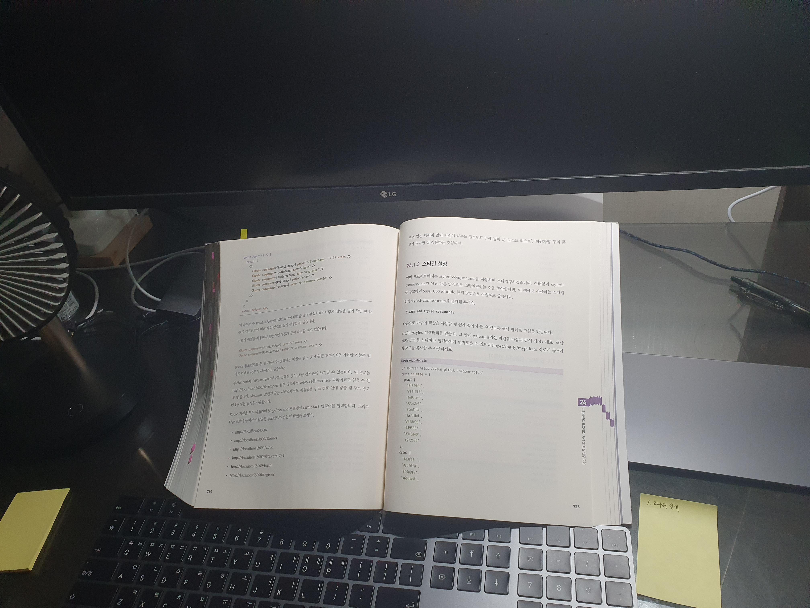

# 리액트를 다루는 기술

> 하루만에 정복하기 홀로 해커톤 🔥
>
> 2020년 12월 11일 18:00 ~ 2020년 12월 12일 18:00

어제 문득 Redux를 다시 한번 돌아봐야겠단 생각이 들었다. 컨셉과 목적만 이해하고 있는 것만으로는 약간 찝찝한 느낌이 있기도하고 가장 대중적인데 실무에서 사용한지는 꽤 되어간다. 그래서 다시 한번 되짚어보는 시간을 갖기로 결심하고, 예전에 Velopert 김민준님을 통해서 Redux를 처음 접했던 기억이 있어서 "리액트를 다루는 기술"을 구입했다. 그리고 `12월 11일 (금) 18:00`에 받았다. 책에 샘플 프로젝트도 있으니 다시 감을 잡는데 도움이 될 것같았다. 물론 공식문서나 나만의 프로젝트도 좋지만, 실무가 아닌 공부를 할 때는 비교적 빠른 시간내에 그리고 명확한 목표를 잡고 공부를 할 수 있는 잘 짜여진 책을 택하는 것이 좋겠단 생각이 들었다. 목표는 과하게도 하루만에 다보기로 작정했다.

대부분은 아는 내용이라 쉽게 쉽게 읽어 넘어갈 수 있었고 정확하게 알지 못했거나 포인트가 되는 부분들은 챕터가 끝나고 따로 기록을 했다. Redux로 실습하는 부분과 프로젝트를 직접 만드는 부분은 실무적으로 그리고 근육이 기억하는데 도움이 될 것같아서 다 따라해봤다. 너무나 초보일 때 봤다면 잘 모르고 힘들었을 것들이 지금은 보이는 것같다. 알게 모르게 이해력이 많이 상승했다.

지금은 `12월 12일 (토) 08:00`. 밤을 꼬박 샜는데 치킨과 햄버거로 3만원을 식비로 지출했다. 하하... 그래도 오랜만에 목표를 가지고 공부하니 행복하다. 이제 약 200페이지, 마지막 프로젝트 챕터만 남겨두고 있는데 잠이 슬슬와서 점심때 쯤 다시 일어나 진행해야할 것 같다.

지금은 `12월 12일 (토) 19:00`. 생각대로 다 끝낼 수는 없었다 하하... 하지만 뒷 내용은 반복되는 부분이라 또 봐야할 것같진 않고 우선은 여기서 마무리하고 다음주에나 한번 복습하는 시간을 가져야겠다. 고생했다.



## 목차

- [리액트를 다루는 기술](#리액트를-다루는-기술)
  - [목차](#목차)
  - [❌ 복습 및 정리](#-복습-및-정리)
  - [7. 컴포넌트 라이프 사이클](#7-컴포넌트-라이프-사이클)
    - [마운트](#마운트)
    - [업데이트](#업데이트)
    - [언마운트](#언마운트)
    - [전체 구조](#전체-구조)
  - [11. 최적화](#11-최적화)
  - [12. 리덕스](#12-리덕스)

## ❌ 복습 및 정리

- [ ] 12월 15일 복습/정리
- [ ] 책에 노트한 내용 복습겸 옮겨적기
- [ ] 25장 이후 실습 마무리

## 7. 컴포넌트 라이프 사이클

### 마운트

```plain
constructor

getDerivedStateFromProps // props를 state에 동기화

render

componentDidMount
```

### 업데이트

컴포넌트가 업데이트 되는 시점

- props가 변경될 때
- state가 변경될 때
- 부모 컴포넌트가 리렌더링 될 때
- this.forceUpdate로 강제로 렌더링을 트리거할 때

```plain
props변경    부모 리렌더링
    |          |
getDerivedStateFromProps
           |
shouldComponentUpdate <=== state 변경
           |
           | <- (false인 경우 취소)
           |
         render       <=== forceUpdate
           |
getSnapshotBeforeUpdate // 컴포넌트 변화를 DOM에 반영하기 직전에 호출됨
           |
    (브라우저 DOM 변화)
           |
   componentDidUpdate
```

### 언마운트

```plain
언마운트
   |
componentWillUnmount
```

---

- getDerivedStateFromProps (>=16.3)

  ```js
  static getDerivedStateFromProps(nextProps, prevProps) {
    (nextProps.value !== prevState.value) {
      return { value: nextProps.value }
    }
    return null; // state 변경 미필요시 null 반환
  }

  ```

- componentDidMount() { ... }
- shouldComponentUpdate(nextProps, nextState) { ... }
- getSnapshotBeforeUpdate

  ```js
  getSnapshotBeforeUpdate(prevProps, prevState) {
    if (prevState.array !== this.state.array) {
      const {scrollTop, scrollHeight } = this.list;
      return {scrollTop, scrollHeight}
    }
  }
  ```

- componentDidUpdate(prevProps, prevState, snapshot) { ... }
  - DOM 업데이트가 완료되고 호출되므로 DOM 조작을 해도 무방
- componentWillUnmount() { ... }
  - componentDidMount에서 등록한 이벤트, 타이머 등을 제거하는 작업 진행

### 전체 구조

```plain

Mount                  Update                    Unmount
  |                      |                          |
constructor              |                 componentWillUnmount
         |               |
        getDerivedStateFromProps
         |               |
         |       shouldComponentUpdate
         |     / (yes)
        render
         |     \
         |        getSnapshotBeforeUpdate
         |               |
componentDidMount componentDidUpdate
```

## 11. 최적화

- 부모 컴포넌트가 리렌더링 되면 자식도 컴포넌트도 리렌더링 된다.
  - => 여기서의 렌더링은 V-DOM의 렌더링으로서 최적화할 필요가 있다.
  - => 자식 컴포넌트에서 렌더링 되지 않아야하는 경우를 알고 처리해줄수 있다.
- shouldComponentUpdate를 활용하고, 브라우저의 performance 탭을 사용할 수 있다.

보통 리스트에서 이런 처리가 필요한 경우가 많다.

## 12. 리덕스

리듀서는 순수해야하므로, 데이터베이스 접근, 네트워크 요청, new Date(), math.random 같은 함수 등도 사용해서는 안됨
