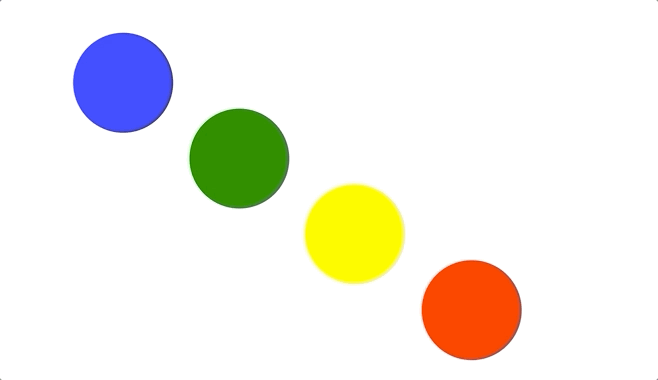

# Interactive Web Animation 2020 [JavaScript, SVG, CSS & HTML]

## 복습 및 정리

## 섹션 1:History of Web Animations

- 1991년: HTML
- 1995년: JavaScript
- 1996년: CSS
- 2001년: SVG
- 2013년: Web Animations API 1.0
- ...

## 섹션 2:CSS Animations

- `svg 태그`는 컨테이너 역할을 하는 듯하다.
- animation
  - animation-direction
  - animation-fill-mode
  - animation-timing-function -> cubic-bezier, steps, ...
  - animation-play-state
  - animation-iteration-count
  - animation-name
  - animation-duration
  - animation-delay
  - @keyframes
- transition
  - transition-property
  - transition-duration
  - transition-delay
  - transition-timing-function

[Cubic Bezier 함수](https://cubic-bezier.com)

| 장점                                                        | 단점 (다음을 지원하지 않는다)   |
| ----------------------------------------------------------- | ------------------------------- |
| 간단한 애니메이션에 편리함                                  | 상대값                          |
| 성능이 좋음                                                 | nested animation                |
| 리소스를 많이 사용하지 않음                                 | 애니메이션 진행상태 보고        |
| GPU 사용                                                    | target discard                  |
| 여러 CPU 스레드 사용                                        | curve                           |
| 브라우저 애니메이션 순서(순차) 제어 -> 보다 정확한 FPS 유지 | cubic-bezier는 두개의 cp만 존재 |
| 속성(attribute) 애니메이샨                                  |
| 스크롤 포지션 애니메이션                                    |
| directional rotation (방향 전환)                            |
| @keyframes 가 커져서 제어하기 힘든 상황이 자주 초래됨       |

## 섹션 3:SVG Animations

SVG 컨텐츠를 animate하는 방법 (아래 방법들을 조합)

- SVG animation 엘리먼트
  - animate: 한 요소를 지속적으로 애니메이션하기 위해서 사용
  - animateMotion: path를 따라 엘리먼트가 이동하도록 함
  - animateTransform: scale, translate, rotate, skewX, skewY 등...
  - discard: 주어진 조건에 애니메이션을 취소(중단)한다.
  - set: 애니메이션 도중에 특정 속성을 변경할 수 있다. (예. stroke를 1초~3초 사이에 다른 색상으로 변경)
- CSS Animation
- CSS Transition
- SVG Document Object Model

animation을 위한 target element를 특정하는 속성

- href

animation의 타이밍을 제어하기위한 속성들

- dur
- begin, end
- fill
- min
- max
- restart
- repeatCount
- repeatDur

애니메이션 값을 계속해서 정의하는 것

- calcMode
  - discrete: 보간없이 끊어져 보임
  - linear
  - paced
  - spline
- values: list of strings
- 다음은 values가 특정된 경우 무시됨
  - from, to: 애니메이션의 시작, 끝 값
  - by: 상대 offset 값
- keyTimes
- keySplines

애니메이션이 속성이 추가적인지 제어하는 속성 (상대적인지 절대적인지)

- additive
  - replace
  - sum
- accumulate (repeat 마다 누적)
  - none
  - sum

### `<animateMotion />`에 의해 애니메이션 가능한 요소

- Graphic Elements
  - image
  - path
  - rect
  - circle
  - ellipse
  - line
  - polyline
  - polygon
- Containers
  - svg
  - g
  - defs
  - switch
  - text
  - mask
  - a
- Graphics Link Elements
  - use
- Other Elements
  - foreignObject
  - clipPath

### 애니메이션 가능한 속성과 프로퍼티에 사용되는 Data types

| -          | `<animate>` | `<animateTransform>` | `<set>` | `Additive` |
| ---------- | ----------- | -------------------- | ------- | ---------- |
| angle      | v           | ❌                   | v       | v          |
| color      | v           | ❌                   | v       | v          |
| frequency  | ❌          | ❌                   | ❌      | ❌         |
| integer    | v           | ❌                   | v       | v          |
| length     | v           | ❌                   | v       | v          |
| number     | v           | ❌                   | v       | v          |
| paint      | v           | ❌                   | v       | v          |
| percentage | v           | ❌                   | v       | v          |
| time       | ❌          | ❌                   | ❌      | ❌         |
| URL        | v           | ❌                   | v       | ❌         |
| other      | v           | ❌                   | v       | ❌         |

보통 애니메이션은 다음과 같이 처리

```svg
<svg>
  <rect>
    <animate ... />
  </rect>
</svg>
```

- 9장에서) 컬러를 additive sum으로 지정해 애니메이션하면 이전 RGB값에 다음 RGB 컬러의 값이 더해지며 계산된다. (즉, 지정한 컬러에 상대적으로 동작함)

### SVG의 interactivity 기능

- .
  - mousedown
  - mouseup
  - click
- .
  - mouseover
  - mouseenter
- .
  - mouseout
  - mouseleave
- .
  - mousemove

```svg
<animateTransform begin="mousedown" />
```

## 섹션 4:Interactive JavaScript Animations

- addEventListener
- setInterval
- `getAttribute`
- `setAttribute`

등을 이용해서 svg 속성을 조정함으로서 애니메이팅...!

### 예제

- [12-circles.html](./section4/circles/circles.html)
  

### 팁

- `<g>` 태그의 transform을 조정해 애니메이팅 (그 값은 pattern matching으로 뽑아내면 편리함)
