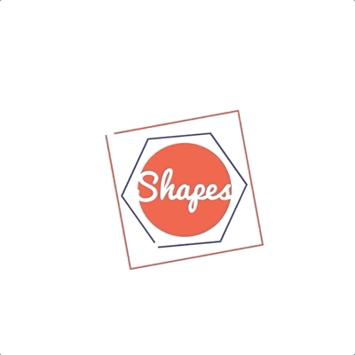
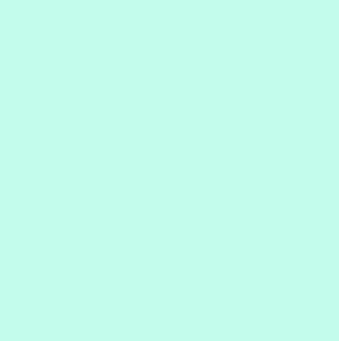

# Learn SVG Animation - With HTML, CSS & Javascript

> 2020-12-30 (수)

## ✅ 복습 및 정리

svg를 css로 제어하고 효과를 줄 수 있다. `mask`를 활용하면 더 멋진 애니메이션 처리가 가능하겠다. 필요한 떄에 아래 내용을 참고하자.

<!-- ## 섹션 1:Welcome To The Course -->

## 섹션 2:Workflow setup and tools for course

- Optimize SVG: https://jakearchibald.github.io/svgomg/

## 섹션 3:SVG Project - Animating a Logo

- SVG를 만들 때, 텍스트를 `create outlines`를 통해 선을 따주어야 해당 폰트가 없는 컴퓨터 환경에서도 잘 보이게 된다.

### SVG API

- [`getTotalLength`](https://developer.mozilla.org/en-US/docs/Web/API/SVGPathElement/getTotalLength): 요소의 전체 path의 길이를 반환 (float)

### 실습 결과



## 섹션 4:Animation Properties

### 실습 결과

- `stroke`를 이용해 라인 색상을 변경 할 수 있음
- `stroke-dashoffset`를 애니메이션화해 animation properties를 이용해 방향과 속도를 조절할 수 있음



## 섹션 5:Hand Drawn Text Animation Project

(특이사항 없음)

## 섹션 6:Social Icons Project

- [transform-box 프로퍼티](https://developer.mozilla.org/en-US/docs/Web/CSS/transform-box): svg에서 transform-origin이 제대로 먹지 않는 경우가 있는데, 이는 transform-box가 기본 `view-box`라 가장 가까운 `<svg />`의 영역으로 잡히지 때문이다. 그래서 `fill-box`로 설정해주면 특정 요소의 영역에 기반해 transform-origin이 등작하도록 할 수 있다.

### 실습 결과


## 섹션 7:Masking & Gradients

### Gradient

```svg
<defs>
  <linearGradient id="brand-gradient">
    <stop offset="0%" stop-color="#f8ed34" />
    <stop offset="50%" stop-color="#ea118d" />
    <stop offset="100%" stop-color="#2e368f" />
  </linearGradient>
</defs>

// fill="url(#brand-gradient)"
```


### Texture


`<mask />`를 만들고, 이를 이용하고자 하는 요소에서 `mask="url(#id)"` 로 사용

```svg
<svg>
  <defs>
    <mask id="texture1">
      <image
        height="400"
        width="800"
        xlink:href="IMAGE_URL"
      ></image>
    </mask>
  </defs>
  <text x="100" y="100" mask="url(#texture1">Texture</text>
</svg>
```

### Masking

- `<mask />`를 씌우면 mask에 정의된 흰 영역에 대해서만 보이게 되는 특징을 활용
- 다른 색상을 마스크로 지정하면 투명하게 비쳐 보임


## 섹션 8:Course Close
