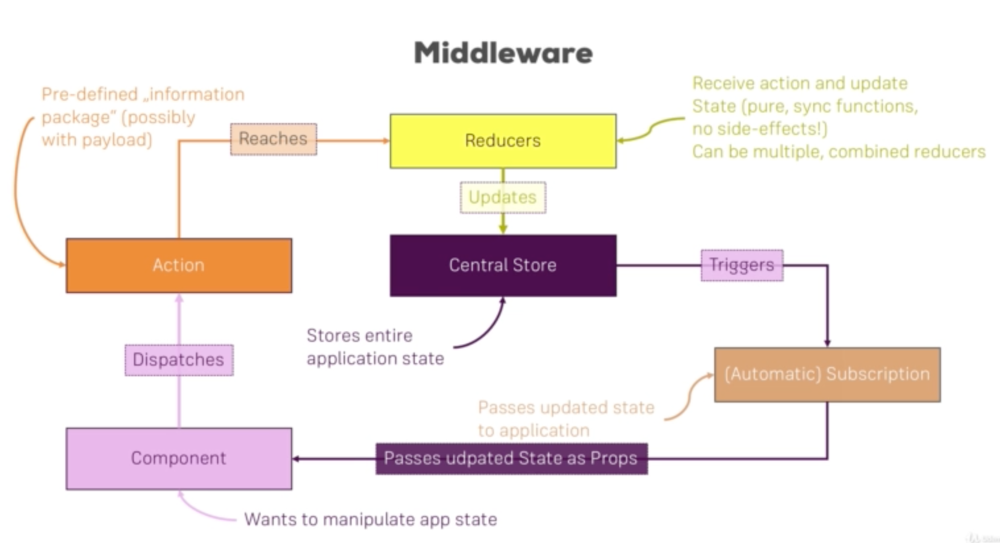

# React - The Complete Guide (incl Hooks, React Router, Redux)

## 목차

- [React - The Complete Guide (incl Hooks, React Router, Redux)](#react---the-complete-guide-incl-hooks-react-router-redux)
  - [목차](#목차)
  - [❌ 복습 및 정리](#-복습-및-정리)
  - [섹션 1:Getting Started](#섹션-1getting-started)
  - [섹션 2:Refreshing Next Generation JavaScript](#섹션-2refreshing-next-generation-javascript)
  - [섹션 3:Understanding the Base Features & Syntax](#섹션-3understanding-the-base-features--syntax)
  - [섹션 4:Working with Lists and Conditionals](#섹션-4working-with-lists-and-conditionals)
    - [더 알아보기](#더-알아보기)
  - [섹션 5:Styling React Components & Elements](#섹션-5styling-react-components--elements)
    - [더 알아보기](#더-알아보기-1)
  - [섹션 6:Debugging React Apps](#섹션-6debugging-react-apps)
  - [섹션 7:Diving Deeper into Components & React](#섹션-7diving-deeper-into-components--react)
    - [더 알아보기](#더-알아보기-2)
  - [섹션 8:A Real App: The Burger Builder (Basic)](#섹션-8a-real-app-the-burger-builder-basic)
  - [섹션 9:Reaching out to the Web (Http / Ajax)](#섹션-9reaching-out-to-the-web-http--ajax)
  - [섹션 10:Burger Builder Project: Accessing a Server](#섹션-10burger-builder-project-accessing-a-server)
  - [섹션 11:Multi-Page-Feeling in a Single-Page-App:Routing](#섹션-11multi-page-feeling-in-a-single-page-approuting)
  - [섹션 12:Adding Routing to our Burger Project](#섹션-12adding-routing-to-our-burger-project)
  - [섹션 13:Forms and Form Validation](#섹션-13forms-and-form-validation)
  - [섹션 14: Redux](#섹션-14-redux)
  - [섹션 15:Adding Redux to our Project](#섹션-15adding-redux-to-our-project)
  - [섹션 16:Redux Advanced](#섹션-16redux-advanced)
  - [섹션 17:Redux Advanced: Burger Project](#섹션-17redux-advanced-burger-project)
  - [섹션 18:Adding Authentication to our Burger](#섹션-18adding-authentication-to-our-burger)
    - [더 알아보기](#더-알아보기-3)
  - [섹션 19:Improving our Burger Project](#섹션-19improving-our-burger-project)
  - [섹션 20:Testing](#섹션-20testing)
  - [섹션 21:Deploying the App to the Web](#섹션-21deploying-the-app-to-the-web)
  - [섹션 22:Bonus: Working with Webpack](#섹션-22bonus-working-with-webpack)
    - [더 알아보기](#더-알아보기-4)
  - [섹션 23:Bonus: Next.js](#섹션-23bonus-nextjs)
  - [섹션 24:Bonus: Animations in React Apps](#섹션-24bonus-animations-in-react-apps)
    - [더 알아보기](#더-알아보기-5)
  - [섹션 25:Bonus: A Brief Introduction to Redux Saga](#섹션-25bonus-a-brief-introduction-to-redux-saga)
    - [더 알아보기](#더-알아보기-6)
  - [섹션 26:React Hooks](#섹션-26react-hooks)
  - [섹션 27:Using Hooks in the Burger Builder](#섹션-27using-hooks-in-the-burger-builder)
  - [섹션 28:Bonus: Replacing Redux with React Hooks](#섹션-28bonus-replacing-redux-with-react-hooks)
  - [섹션 29:Bonus: Building the Burger CSS](#섹션-29bonus-building-the-burger-css)
  - [섹션 30:Next Steps and Course Roundup](#섹션-30next-steps-and-course-roundup)

## ❌ 복습 및 정리

## 섹션 1:Getting Started

- 왜 리액트인가?
  - UI 상태를 일반 JavaScript로 다루기가 어려워졌다.
  - 앱이 터져나가는 것을 방지하는 것이 아닌, 비지니스 로직에 집중하기 위해
- SPA vs MPA
  - SPA
    - HTML 페이지 한개, 내용은 클라이언트에서 (re)렌더링됨
    - 하나의 `ReactDOM.render()`
  - MPA
    - 여러 HTML 페이지 (각 경로마다 다른 HTML)
    - 각 위젯(영역)마다 사용하는 기술이 다를 수 있고, 만약 그게 리액트라면 `ReactDOM.render()`가 여러번 호출되어 페이지가 그려질 것임

## 섹션 2:Refreshing Next Generation JavaScript

- default export, named export
- \* 로 모든 named export를 참조할 수 있음
- Array functions
  - [`find()`](https://developer.mozilla.org/en-US/docs/Web/JavaScript/Reference/Global_Objects/Array/find)
  - [`concat()`](https://developer.mozilla.org/en-US/docs/Web/JavaScript/Reference/Global_Objects/Array/concat?v=b)
  - [`slice()`](https://developer.mozilla.org/en-US/docs/Web/JavaScript/Reference/Global_Objects/Array/slice)
  - [`splice()`](https://developer.mozilla.org/en-US/docs/Web/JavaScript/Reference/Global_Objects/Array/splice)

## 섹션 3:Understanding the Base Features & Syntax

- [리액트에서 지원되는 이벤트 목록](https://reactjs.org/docs/events.html#supported-events)
- setState가 전달받은 프로퍼티들로 일부만 업데이트하는 반면, useState는 그런 특성을 가지지 않고 넘긴 데이터로 대체함

## 섹션 4:Working with Lists and Conditionals

### 더 알아보기

- [Lists & Keys](https://reactjs.org/docs/lists-and-keys.html)

## 섹션 5:Styling React Components & Elements

### 더 알아보기

- [라이브러리 - Radium](https://github.com/formidablelabs/radium): style내에서 :hover, @media 등 사용가능
- [CSS Module](https://github.com/css-modules/css-modules)
  - 자동으로 class명을 만들어준다 보면 되겠다
  - `:global` prefix를 갖는 클래스로 정의하면, 자동으로 변환된 클래스가 아니라 개발자가 정의한 클래스명이 나올 것이다.

## 섹션 6:Debugging React Apps

- [브라우저 디버거](https://developers.google.com/web/tools/chrome-devtools/javascript/)를 사용하면 break point 등을 걸고 그 내용을 확인할 수 있기 때문에 편리하다
- [ErrorBoundary](https://reactjs.org/docs/error-boundaries.html)를 사용하면 에러 로그 등을 수집하기 편리하다.

## 섹션 7:Diving Deeper into Components & React

- [ ] 89 ~ 97 다시 보기

- props를 이용해 초기화 해야하는 경우 constructor에서 state 초기화 처리
- creation, props change, state change
- shouldComponentUpdate, React.Memo 등은 추가적인 계산을 동반하므로 꼭 좋은 것은 아니다. 필요에 따라 적용
- 리액트는 DOM을 어떻게 업데이트할까?
  - shouldComponentUpdate를 통과하면, Old vDOM vs New vDOM 간에 비교를 통해 다시 그릴지 결정
- HOC
  - HOC로 컴포넌트를 감싸면, 감싼 컴포넌트를 그리는 컴포넌트를 반환함을 기억해야한다 (그래야 props가 어떻게 넘어가는지 이해할 수 있다.)
- setState시 이전 상태에 기반해 업데이트해야하는 경우 function으로 업데이트를 진행해주는게 좋다.
- Refs
  - ComponentDidMount 등에서 document.query~를 해서 선택해도 되지만 React way는 아니다. 또한 DOM전체에서 탐색하므로 효율적이지도 않다.
  - `ref` keyword를 사용할 수 있다.
    - 1. 이전 버전 리액트에서도 사용가능한 방법: `ref = {(el) => { this.el = el }}`
    - 2. 16.3에서 추가된 방법: `this.el = React.createRef()` 를 생성자에서 수행 후, `ref = {this.el}`. 그러면 `this.el.current.API()` 식으로 이용가능
    - 3. `useRef()`. ref 참조를 사용할 때에는 DOM을 한번 그리고 난 뒤에 참조해야하므로, render 후에 항상 수행되는 `useEffect`를 사용해 참조를 통해 조작을 수행하면 된다.
- Context
  - Context를 이용하면 prop drilling을 피할 수 있고 상위 트리 어디에선가 전달한 값을 필요한 하위 트리에서 사용할 수 있다.
  - [ ] Context Provider, Consumer 에서 value가 변할 때 어떻게 업데이트가 진행되는지 정확하게 파악하는게 중요하겠음 (설계시 성능 고려 지점이 어디인지 파악)
  - class 컴포넌트에서 `static contextType`을 지정하면 `this.context`로 해당 컨텍스트를 조회할 수 있음
- 모달
  - z-index가 **높을수록** 사용자와 가까이 위치
- 모달 같은 것에서 shouldComponentUpdate로 제어하면 children도 업데이트 받을지 아닐지 영향을 받는다.

### 더 알아보기

- 컴포넌트 라이프 사이클 vs React Hooks
- `(1.9999).toFixed(2)`

## 섹션 8:A Real App: The Burger Builder (Basic)

- 일반적인 리액트 앱 설계 절차
  - 1. 컴포넌트 트리/컴포넌트 구조 설계 (디자인 그려보고 컴포넌트 분리)
  - 2. 앱 상태 정의 (data, state)
  - 3. 컴포넌트와 컨테이너를 구분하고 설계

## 섹션 9:Reaching out to the Web (Http / Ajax)

- componentDidUpdate에서는 side effect를 내도 괜찮지만, 대개 상태 변경을 해서는 안된다 (rerender되므로). 그래서 side effect 를 내는 경우에는 발생에 대한 조건 처리를 적절하게 잘 해주어야할 것이다.
- axios
  - [axios interceptors](https://github.com/axios/axios#interceptors)를 이용하면, 요청 중간에 middleware로서 처리를 할 수 있다.
  - 인스턴스에 필요한 설정을 가하고 사용하면 편리하다.

## 섹션 10:Burger Builder Project: Accessing a Server

## 섹션 11:Multi-Page-Feeling in a Single-Page-App:Routing

- spa: 각 페이지가 실제 페이지는 아니지만, 자바스크립트에 의해 제어되어 다른 페이지 처럼 보여진다.
- `URLSearchParams`을 이용하면 쿼리 파라미터를 손쉽게 파싱할 수 있다.
- `props.location.hash`를 이용하면 fragment에 접근할 수 있다.
- nested routes에서 `this.props.match.url + '/:id'`식으로 상대 경로를 지정하면 편리할 수도 있겠다.
- 라우트 지정시, auth check등을 통해 보여주지 않아야할 라우트라면 conditional rendering을 통해 `this.state.auth ? <Route ... /> : null` 식으로 처리해주면 보기 좋은 경우도 있다. (Guard라고 한다)
- 라우트에 컴포넌트를 지정할 때 async import를 활용함으로서, 라우팅 기반 코드 스플릿팅이 가능하다. (React.lazy와 Suspense를 활용하면 편리하다. suspense에는 fallback 옵션으로, 로딩하는 동안에 다른 컨텐츠를 표시해줄 수 있다.)
- BrowserRouter의 basename을 이용하면 기본 경로를 지정할 수 있다.

## 섹션 12:Adding Routing to our Burger Project

## 섹션 13:Forms and Form Validation

- 강의에서는 form의 모양을 상태로서 표현하고 Input 컴포넌트 하나에 각 상태를 매칭시켜 제어하는 방식을 선택했다. 방식은 상황에따라 선택하면 되겠다.
- touched 상태를 관리하고, 변경이나 focus시 이를 업데이트 하도록 하면 되겠다.

## 섹션 14: Redux

- 불변성을 위해 concat, Object.assign, ...을 이용하자
- array에 대해서 splice는 기존 배열을 수정하므로, 잘 알고 사용하자
- [Immutable Update Patterns](https://redux.js.org/recipes/structuring-reducers/immutable-update-patterns/)

## 섹션 15:Adding Redux to our Project

- Redux Middleware

  - middleware를 이용하면 action이 dispatch되는 과정에 추가적인 처리를 할 수 있다.

    ```js
    const logger = (store) => {
      return (next) => {
        return (action) => {
          console.log("Dispatching...", action);
          const result = next(action);
          console.log("Next State...", store.getState());
          return result;
        };
      };
    };

    // applyMiddleware()~
    ```

  - 

## 섹션 16:Redux Advanced

- 데이터 변환 로직은 대개 Action creator 보다는 reducer에 있는 것이 추천됨

| Action Creator                                   | Reducer                   |
| ------------------------------------------------ | ------------------------- |
| 비동기 코드를 실행 가능                          | 순수, 동기 코드만         |
| state 업데이트를 너무 많이 준비하지 말아야 할 것 | 리듀서는 state를 업데이트 |

## 섹션 17:Redux Advanced: Burger Project

특별한 내용은 없고, 리듀서를 구성할 때 아래위로 읽기 힘들어질 수 있어서, helper함수를 구성해 처리하면 좀더 읽기 편해진다는 점 정도인데, 이건 팀따라 다르겠다.

## 섹션 18:Adding Authentication to our Burger

- 로그인시 redux 스토어에 `authRedirectPath` 등을 두고 마지막 페이지로 돌아가도록 처리하면 UX에 좋겠다.
- 브라우저의 sources 에서 break point를 설정하고 디버깅할 수 있다.

### 더 알아보기

- [ ] access token, refresh token 그리고 보안. 탈취 시나리오와 사례에 대해서
- SPA Authentication in general: https://stormpath.com/blog/token-auth-spa

## 섹션 19:Improving our Burger Project

- 햄버거 메뉴 클릭시 자동으로 닫히게 하는 등의 UX 점검하고 수정하기
- 깨지는 스타일 점검하기
- 공통 메서드 함수로서 추출하기
- 환경변수 사용하기 (production과 devleopment 구분, devtools 같은 것들)
- console.log 제거하기
- Lazy loading 추가 해서 필요한 때 요청하도록 처리하기

## 섹션 20:Testing

- Redux 스토어를 제외하고 테스트하기 위해 connect 되지 않은 클래스 그 자체를 테스트 하기도 한다.
- Redux를 테스트함에는 reducer를 테스트하는 것이 가장 효율적이겠다.

## 섹션 21:Deploying the App to the Web

1. basename 점검. 서버에서 이를 핸들링 할 수 있도록 해야함
2. 빌드 최적화
3. 서버가 항상 index.html을 서빙하도록 설정해야함 (404 케이스도 클라이언트가 제어하도록)

## 섹션 22:Bonus: Working with Webpack

- 웹팩은 기본적으로 파일을 합쳐주는 번들러이지만, 최적화하고 파일을 변환하는 등의 추가 작업도 가능하다.
  - entry 파일로 부터 의존성을 분석하고, 결과물로서 올바르게 정렬된/그리고 합쳐진 파일을 내놓는다
  - 그 과정에 loader가 설정한 룰에 따라 각 파일(모듈 import)에 적용되어 변환 처리된다.
  - 그 후 plugin이 합쳐진 파일을 받아 전역 레벨의 작업을 처리한다 (파일 추출, uglify 등...)
- babel
  - 이용시 node_modules를 제외할지 처리하도록 하고
  - @babel/preset-env 이용시 targets - browsers 옵션을 사용해 브라우저 타겟팅 할 수 있음을 기억하자

### 더 알아보기

- [ ] loader의 적용순서를 매번 헷갈리는데 정확하게 정리

## 섹션 23:Bonus: Next.js

특징들만 되짚어보자

- 파일 구조 기반 라우팅인 점
- 자동 코드 스플리팅
- `<Link href=""><a>Link</a></Link>` 식으로 링크 수행
- page의 `static async getInitialProps(context)`에서 초기에 필요한 데이터를 받아올 수 있다.

## 섹션 24:Bonus: Animations in React Apps

- `display block <-> none` 이면, transition이 먹히지 않는다. (🤔 내부적인 정확한 이유는 모르지만 브라우저 render tree 형성 과정을 생각해보면 그럴 수 있을 것같다)
- CSS animation이나 transition을 사용하면 충분히 좋은 애니메이션 효과를 낼 수 있다. 하지만, DOM에 엘리먼트가 계속 남아 있는 경우가 생길 수 있다.
  - 그렇다고 conditional rendering을 수행하면 DOM에서 즉시 떨어지기 때문에 애니메이션에 일어나지 않을 수 있다. (클래스 토글로 애니메이션이 구현된 경우)
- `React Transition Group`을 이용하면 위에서 겪은 문제를 어느정도 해결할 수 있다.
  - https://github.com/reactjs/react-transition-group
  - 다음 4가지 상태로 제어가 가능하다.
    - 'entering'
    - 'entered'
    - 'exiting'
    - 'exited'
  - enter, exit 두 타이밍을 지정할 수 있다.
- 🛎 조사해본 결과, Material UI도 내부적으로 위 라이브러리를 이용함을 알 수 있다. (https://github.com/mui-org/material-ui/blob/1068e2002465d8b784a781020589a691e416b82d/packages/material-ui/src/Fade/Fade.js#L107-L135)

🛎 결론적으로 자동으로 css 애니메이션과 완벽한 시간적 동기화를 제공하진 못한다. 하지만 CSS 애니메이션과 시간을 동일하게 지정하면, CSS와 거의 비슷한 시간에 또 애니메이션이 적용되어야하는 시점을 파악하고 어느정도 비슷하게 React 컴포넌트와 CSS Animation이 처리될 수 있도록 도와주는 라이브러리라고 볼수있을 것같다.

- `CSSTransition`을 이용하면 지정한 클래스의 뒤에 enter, exit 같은 postfix가 **상태에 따라 자동으로** 붙으므로, 떄에따라 편리하게 사용할 수 있다. 즉 CSS 클래스만 잘 만들어주면 된다. 이는 `Transition`을 기반으로 만들어진 헬퍼라고 봐도 무방하다. (http://reactcommunity.org/react-transition-group/css-transition)
- `TransitionGroup`를 사용하면 리스트의 애니메이션을 제어할 수 있다. 이는 애니메이션을 정의하진 않고 각 리스트에 in prop을 제어한다. 리스트의 각 아이템은 `Transition` 이어야한다
- 애니메이션 대안
  - [react-motion](https://github.com/chenglou/react-motion)
  - [react-move](https://github.com/sghall/react-move)
  - [react-router-transition](https://github.com/maisano/react-router-transition)

### 더 알아보기

- [ ] ease-in, ease-out 같은 타이밍 함수가 어떻게 동작하는지 알아둘 필요가 있겠다.

## 섹션 25:Bonus: A Brief Introduction to Redux Saga

thunk와 다르게, 액션 dispatch와 mix되지 않는 접근 방법

```js
import { put } from "redux-saga/effects";

// This is saga
function* logout(action) {
  yield localStorage.removeItem("token");
  yield put({
    type: "AUTH_LOGOUT",
  });
}
```

```js
import { takeEvery } from "redux-saga/effects";

// Watcher; saga 미들웨어 등록시 run해주면 된다.
function* watchAuth() {
  yield takeEvery(actionTypes.AUTH_INIT_LOGOUT, logout);
}
```

사이드 이펙트를 가진 로직들이 사가로 분리됨으로서, 결과적으로 saga를 사용하면 thunk를 사용하는 것에 비해 action creator를 lean하게 유지할 수 있다.

- saga의 `call` 등을 이용하면 generator를 테스트 가능하게 도와준다.

🔍 [Pros/cons of using redux-saga with ES6 generators vs redux-thunk with ES2017 async/await](https://stackoverflow.com/questions/34930735/pros-cons-of-using-redux-saga-with-es6-generators-vs-redux-thunk-with-es2017-asy/34933395)

### 더 알아보기

- [ ] Saga watcher를 구성했을 때, 함수 내 순서는 어플리케이션에 어떤 영향을 미치는가?

## 섹션 26:React Hooks

- setState, state Update는 batch로 일어난다. 즉, 동일 함수 스택(실행컨텍스트라고 이해하면 되겠다)에서 일어나는 업데이트는 render를 한번만 유발한다. (https://github.com/facebook/react/issues/10231#issuecomment-316644950)

## 섹션 27:Using Hooks in the Burger Builder

## 섹션 28:Bonus: Replacing Redux with React Hooks

TODO: 472 ~ 480 보기

Redux에 비해 Context는 적은 업데이트 (theme, lang) 등에 적합한 편

```js
// custom store
let globalState = [];
let listeners = [];
let actions = {};

export const useStore = () => {
  const setState = useState(globalState)[1];

  const dispatch = (actionIdentifier) => {
    const newState = actions[actionIdentifier](globalState);
    globalState = { ...globalState, ...newState };

    for (const listener of listeners) {
      listener(globalState);
    }
  };

  useEffect(() => {
    listeners.push(setState);

    return () => {
      listeners = listeners.filter((li) => li !== setState);
    };
  }, [setState]);

  return [globalState, dispatch];
};

export const initStore = (userActions, initialState) => {
  if (initialState) {
    globalState = { ...globalState, ...initialState };
  }
  actions = { ...actions, userActions };
};
```

## 섹션 29:Bonus: Building the Burger CSS

- box-shadow 의 inset을 활용해 약간 어두운 색상을 지정하면 입체감, 음영을 살릴 수 있다.
- 배경으로 미세하게라도 linear-gradient를 활용하면 입체감을 살릴 수 있다.

## 섹션 30:Next Steps and Course Roundup

- [react.rocks](https://react.rocks/)
- Google "built with react"
- 그 외 프로젝트 들... Gatsby.js, React Native, Preact
