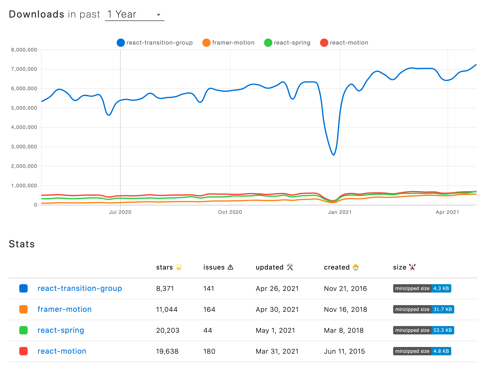

# React Animation

- [React Transition Group](https://github.com/reactjs/react-transition-group)
  - 애니메이션 라이브러리가 아니다.
  - transition stages(enter, exit 등...)를 드러내고 클래스 관리, 요소 묶기, DOM 조작을 유용하게 해준다.
  - minzipped size: 4.3kb
- [Framer Motion](https://github.com/framer/motion)
  - [minified 번들 사이즈](https://www.framer.com/api/motion/guide-reduce-bundle-size/)
    - 전체: 30kb
    - AnimatePresence, usePresence: 1.4kb
    - motion: 25kb
- [React Motion](https://github.com/chenglou/react-motion)
  - minzipped size: 4.8kb
- [React Spring](https://github.com/pmndrs/react-spring)
  - minzipped size: 52.3kb

[NPM Trends](https://www.npmtrends.com/react-transition-group-vs-framer-motion-vs-react-spring-vs-react-motion)

## Framer Motion

[The Net Ninja - Framer Motion (for React) Tutorial](https://www.youtube.com/watch?v=2V1WK-3HQNk&list=PL4cUxeGkcC9iHDnQfTHEVVceOEBsOf07i)
