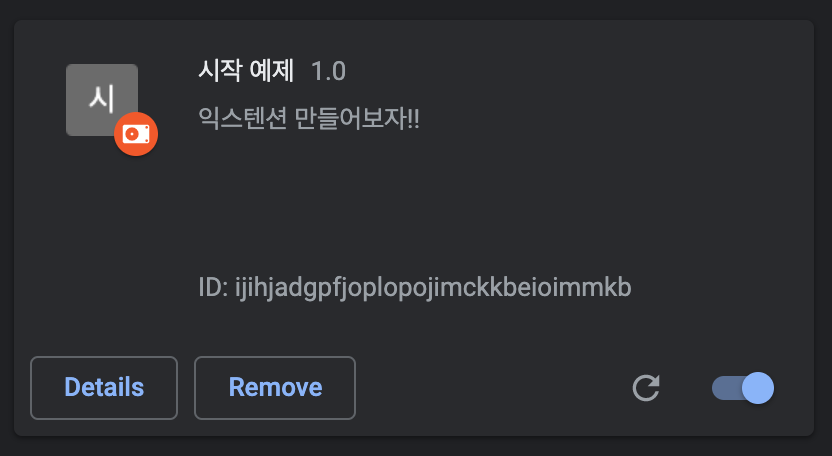

# Chrome Extension

## Getting Stated

1. chrome://extensions 접속
2. 우측 상단 `Developer mode` 활성화
3. `[Load unpacked]` 선택하고 개발중인 디렉토리 선택

   

- manifest에 다음과 같은 값이 필요하다
  - service_worker
  - permissions

## References

- https://developer.chrome.com/docs/extensions/

## Practice

- [Capture Network](./capture-network)
- [My Getting Started](./my-getting-started)
