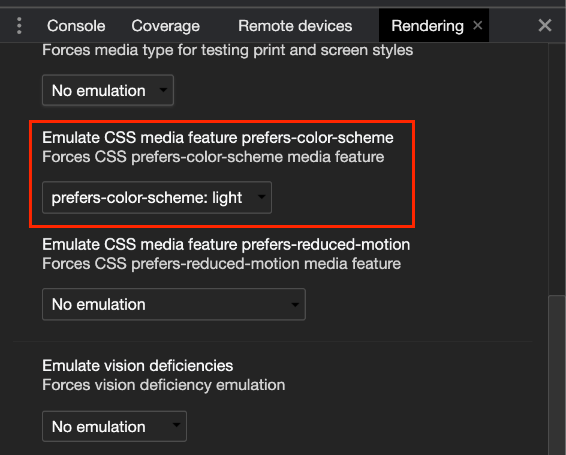

# Dark Mode

## Start

```plain
yarn start
```

## 노트

- Android 기본 WebView는 시스템 theme(light/dark)를 상속받지 못합니다. 오직 `no-preference`로 평가됩니다.
  - [@media/prefers-color-scheme](https://developer.mozilla.org/ko/docs/Web/CSS/@media/prefers-color-scheme)
- 반면, Chrome 앱으로 열면 정상적으로 동작합니다 (시스템 theme을 따라감)
- 크롬 디버거에서 선호하는 색상을 변경할 수 있다.
  
- 다음 코드로 시스템 설정을 확인가능하다.

  ```js
  // 아래 둘은 동작함
  if (window.matchMedia("(prefers-color-scheme: light)").matches) {
    // when light
  }
  if (window.matchMedia("(prefers-color-scheme: dark)").matches) {
    // when dark
  }

  // 이 코드는 동작하지 않는다. 그러므로 `light` or `dark`가 아니라면 no-preference로 간주하는게 좋다.
  if (window.matchMedia("(prefers-color-scheme: no-preference)").matches) {
    // Never
  }
  ```

## 더 알아보기

- [ ] 안드로이드 웹뷰에 메서드를 적용하거나 다른 방법을 통해 `prefers-color-scheme`으로 다크모드임을 인지할 수 있도록 할 수 있을까?
- [ ] iOS는 어떤 이슈가 있을까?
