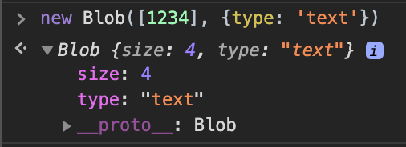
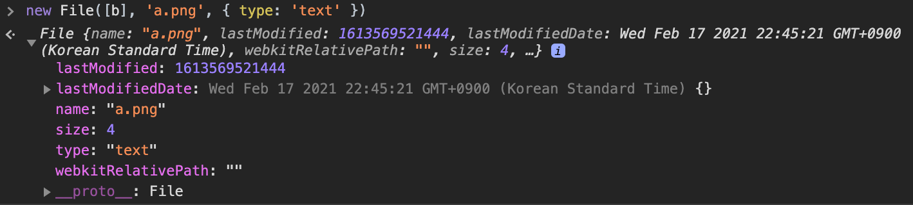

# File

- https://developer.mozilla.org/ko/docs/Web/API/File
- https://javascript.info/file

File 객체는

- 특정 종류의 Blob이며, Blob을 사용할 수 있는 모든 맥락에서 사용할 수 있습니다.
- Blob을 상속하고 파일 시스템 관련 능력을 확장한 것

## 생성자

```js
// new File(bits, name[, options]);
var file = new File(["foo"], "foo.txt", {
  type: "text/plain",
});
```

- bits: `ArrayBuffer`, `ArrayBufferView`, `Blob`, 또는 `DOMString` 객체로 이루어진 Array
- name: 파일명이나 파일의 경로를 나타내는 `USVString`
- options
  - type: MIME 유형을 나타내는 DOMString (default: '')
  - lastModified: 변경 타임스탬프 (default: Date.now())

## Blob과의 관계

File 인터페이스는 Blob을 구현/상속해 다음 속성/메서드를 사용할 수 있다.

- read-only 속성
  - File.size
  - File.type
- 메서드
  - Blob.slice()
  - Blob.stream()
  - Blob.text()
  - Blob.arrayBuffer()

File은 Blob에 추가적인 프로퍼티를 제공한다.

- name: 파일의 이름
- lastModified: 마지막 수정된 타임스탬프

## Browser Support

`File` API는 IE11에서 지원되나 생성자를 사용할 수 없다. File은 사실 Blob에 몇가지 정보를 추가로 얹은 녀석이기 때문에 Blob을 이용해 File 인터페이스를 구현해주면 거의 동일하게 사용할 수 있다.

```js
const file = new Blob([...], { type: ... });
file.name = filename;
file.lastModifiedDate = new Date();
file.lastModified = Number(file.lastModifiedDate);

// == new File([...], filename, { type: ... })
```

### Blob 구현



### File 구현


