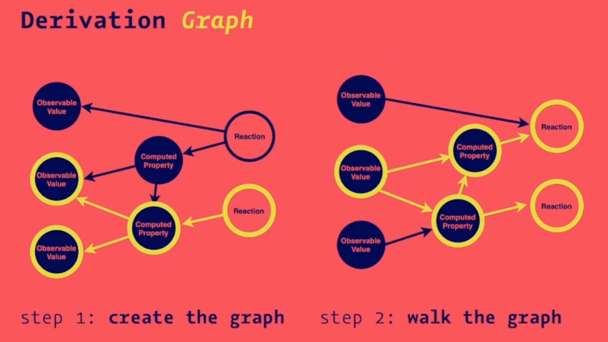

# Reinventing MobX

> https://www.youtube.com/watch?v=P_WqKZxpX8g

## Getting Stated

```plain
yarn // install deps
yarn mobx // cli
yarn mobx-react // see mobx-react binding
```

## Derivation Graph

- 1. create graph
- 2. walking graph



## with React

- observable changes ==> React component renders
- autorun(() => Album.render());
